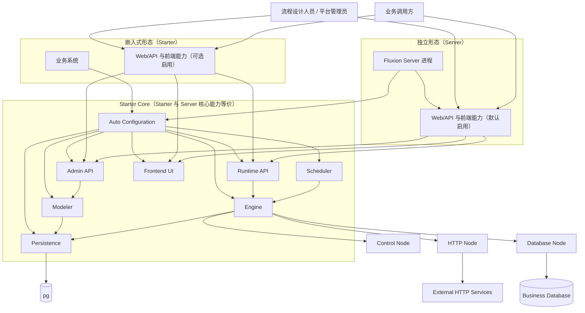
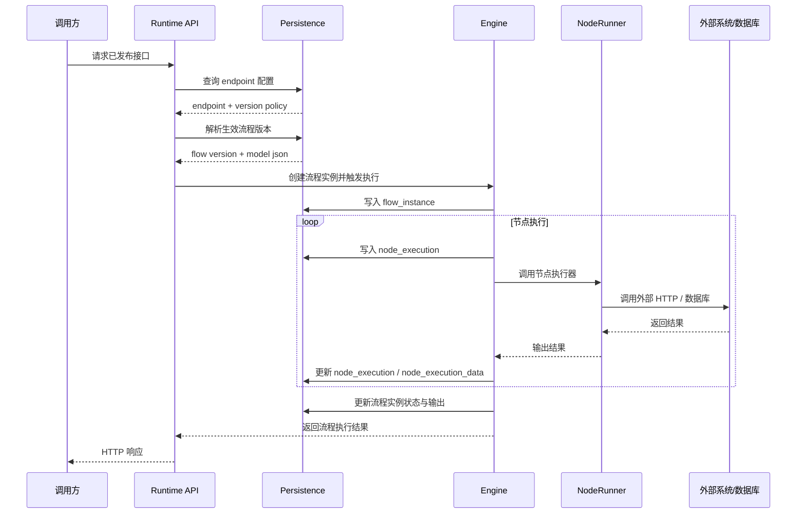
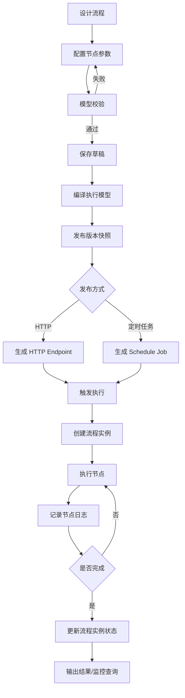

# Fluxion

Fluxion 是一个基于 Spring Boot 的可视化流程编排系统，用来把常见的业务集成逻辑抽象成可设计、可发布、可执行、可监控的流程。

它的目标不是做通用 BPM，也不是做重量级 ESB，而是聚焦在“业务集成编排”这类场景：HTTP 调用、数据库操作、条件分支、变量转换、定时触发，以及后续可扩展的插件节点。

它的核心目标是把常见的集成逻辑沉淀为统一的流程模型，并支持设计、发布、执行、监控和治理。

## 项目定位

Fluxion 同时支持两种产品形态：

1. `Starter`
   以 Spring Boot Starter 的方式嵌入业务系统，核心能力与 `Server` 等价（设计、发布、执行、监控、治理）；默认不自启独立 Web 端口，可按宿主需要启用 Web/API 与前端页面能力。
2. `Server`
   基于 `Starter` 提供开箱即用的独立部署形态，默认启用 Web/API 暴露与前端页面集成能力，并以独立进程运行。

设计边界如下：

- 主流程必须是 DAG
- 默认执行语义为 `at-least-once`
- 不提供分布式事务，由重试、补偿策略兜底
- 插件、脚本、流式处理等高阶能力按阶段逐步建设

## 核心能力

一期聚焦最小可用闭环，核心能力包括：

- 可视化流程设计与版本快照
- 流程发布为 HTTP 接口
- 流程发布为定时任务
- 基础执行引擎：顺序、条件、有限并发、变量传递、超时、重试
- 基础节点：日志、变量、条件、HTTP、数据库查询/更新
- 运行监控：流程实例、节点执行记录、输入输出快照、异常信息
- 基础治理：资源连接与密钥托管、操作审计、限流与重入控制

## 适用场景

Fluxion 适合以下类型的场景：

- 将一组 HTTP 调用和数据处理逻辑编排成统一接口
- 将数据库查询、数据转换、回写更新编排成自动化流程
- 将已有业务逻辑通过定时任务触发执行
- 为内部平台提供低代码集成能力

不适合的场景：

- 复杂人工审批流
- 强事务一致性编排
- 大规模实时流处理

## 当前仓库状态

当前仓库处于一期设计与骨架阶段，已经包含：

- 项目正式需求文档
- 技术方案文档
- 分期计划表
- 一期数据库表结构修订版
- 一期 Maven 多模块骨架

当前还没有完整业务代码实现，仓库更准确地说是“一期开发基线”。

## 文档优先级

当前仓库的文档使用以下优先级规则：

- [docs/base.md](./docs/base.md) 与 `docs/phase-1/*` 是当前仓库唯一正式基线，用于需求确认、开发实现、测试验收和交付收口
- `RAWDOC/*` 作为历史参考资料，保留原始讨论和早期方案
- 若 `README.md`、`RAWDOC/*` 与正式基线文档存在冲突，请提出疑问

## 一期默认实现约定

一期默认实现约定已经归档到正式文档：

- 统一规范与通用约定见 [base.md](./docs/base.md)
- 产品范围与交付边界见 [requirements.md](./docs/phase-1/requirements.md)
- 技术实现与工程决策见 [technical-solution.md](./docs/phase-1/technical-solution.md)

补充说明：

- 一期产品目标包含基础前端可视化设计能力
- 草稿独立存储且不占正式版本号，发布时才分配新的正式版本号
- 当前仓库仍处于骨架和设计阶段，后续编码顺序会优先从后端底座开始

## 一期模块结构

当前仓库使用根目录聚合 POM [pom.xml](./pom.xml) 管理一期模块，`artifactId` 为 `fluxion-parent`。各模块直接位于仓库根目录：

```text
Fluxion/
├── pom.xml
├── fluxion-dependencies
├── fluxion-common
├── fluxion-model
├── fluxion-spi
├── fluxion-modeler
├── fluxion-engine
├── fluxion-persistence-mybatisplus
├── fluxion-scheduler
├── fluxion-runtime-api
├── fluxion-admin-api
├── fluxion-expression-spel
├── fluxion-node-control
├── fluxion-node-http
├── fluxion-node-database
├── fluxion-spring-boot-starter
├── fluxion-server
└── fluxion-test
```

模块职责概览：

- `fluxion-model`: 领域模型
- `fluxion-spi`: 扩展接口
- `fluxion-modeler`: 画布 JSON 编译与校验
- `fluxion-engine`: 执行引擎
- `fluxion-persistence-mybatisplus`: 持久化实现
- `fluxion-runtime-api`: 运行时触发接口
- `fluxion-admin-api`: 管理与监控接口
- `fluxion-spring-boot-starter`: 嵌入式接入入口
- `fluxion-server`: 独立部署入口

## 项目架构图



这个架构的核心点有两条：

- `Starter` 与 `Server` 核心能力等价；`Starter` 默认不自启独立 Web 端口，Web/API 与前端页面能力可按宿主需要启用
- `Server` 是基于 `Starter` 的独立部署形态，默认启用 Web/API 与前端页面能力并独立进程化运行

## 时序图

下面是“一次 HTTP 请求触发流程执行”的核心时序：



## 流程图

下面是 Fluxion 一期从设计到运行的主流程：



## 数据库设计

数据库设计以“设计态 + 运行态 + 暴露与调度 + 治理”四层为主：

- 设计态：流程定义、流程草稿、流程版本
- 运行态：流程实例、节点执行、节点执行尝试明细
- 暴露与调度：HTTP 接口发布、定时任务、触发流水
- 治理：资源连接、资源密钥、操作审计

一期详细 DDL 见：

- [db.txt（原始资料）](./RAWDOC/db.txt)
- [schema-pg.sql（一期正式 DDL）](./docs/schema-pg.sql)

## 文档入口

- [产品总览](./docs/overview/product-overview.md)
- [架构总览](./docs/overview/architecture-overview.md)
- [路线图](./docs/overview/roadmap.md)
- [一期正式需求文档](./docs/phase-1/requirements.md)
- [一期技术方案文档](./docs/phase-1/technical-solution.md)
- [一期运行语义规范](./docs/phase-1/runtime-semantics.md)
- [一期 HTTP 发布契约](./docs/phase-1/http-endpoint-contract.md)
- [一期资源契约](./docs/phase-1/resource-contract.md)
- [一期认证凭证契约](./docs/phase-1/auth-credential-contract.md)
- [一期调度契约](./docs/phase-1/schedule-contract.md)
- [一期节点 Schema 详细定义](./docs/phase-1/node-schemas.md)
- [一期计划](./docs/phase-1/plan.md)


## 快速开始

### 环境要求

- JDK 21
- Maven 3.9+
- pg

### 校验 Maven 骨架

```bash
mvn -q validate
```

### 初始化数据库

执行一期 DDL（flyway 自动执行）：

```text
docs/schema-pg.sql
```

## 开发路线

### 一期

目标：建立最小可用闭环。

- 流程设计与版本管理
- 基础前端可视化设计器
- HTTP 发布与调度触发
- 执行引擎与基础节点
- 实例监控与基础治理

### 二期

目标：提升平台复用性和可运维性。

- 子流程
- 模板库
- 脚本节点
- Redis 节点
- Quartz 集群
- 观测与告警

### 三期

目标：建立生态扩展和高阶处理能力。

- 插件体系
- 前端插件动态加载
- 流式处理
- 断点调试
- 更多数据库方言支持

## 后续建议

如果继续往下实现，优先顺序建议为：

1. 完成 `model + spi + engine` 的基础代码
2. 完成 MyBatis-Plus 的实体与仓储实现
3. 完成 Runtime API / Admin API 骨架
4. 完成 Starter 自动配置
5. 再补可视化前端与联调能力

## License

当前仓库未声明最终开源协议，建议在准备公开发布前补充正式 License。
